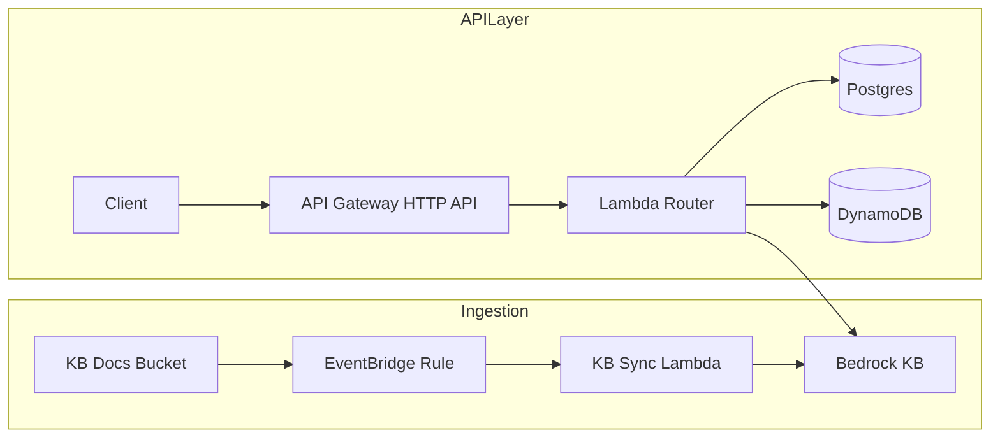
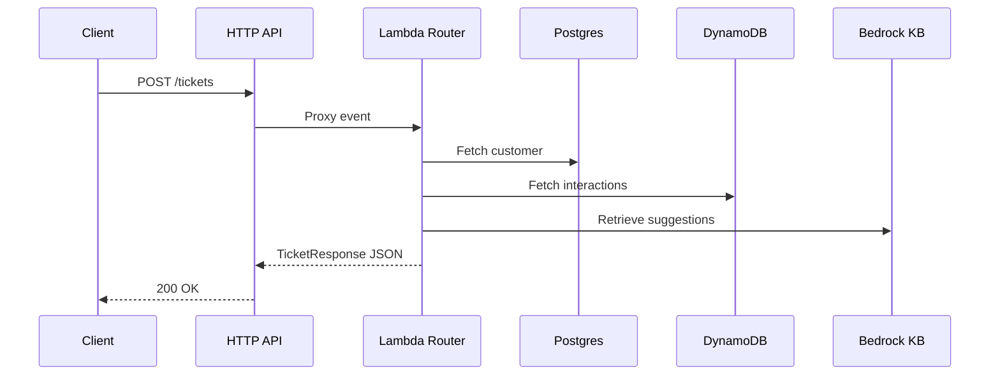

# AI-Assisted Customer Support & Helpdesk Automation (Phase 1)

> Minimal, cost-optimized reference implementation for the Phase 1 spec.  
> Uses AWS CDK (Python), single Lambda router, Bedrock KB, RDS Postgres, DynamoDB.

## Quick start (Windows-friendly)
1) Create venv + install deps (PowerShell):
   - `py -m venv .venv`
   - `.\.venv\Scripts\Activate.ps1`
   - `pip install -r requirements.txt`
2) Prereqs: install AWS CLI v2, Node.js 18+, `npm install -g aws-cdk`.
3) Bootstrap CDK (first time, London for Paris proximity): `cdk bootstrap aws://YOUR_ACCOUNT/eu-west-2`
4) Deploy (dev):
   - `$env:ENVIRONMENT="dev"`
   - `$env:AWS_REGION="eu-west-2"`  # Bedrock + proximity to Paris
   - `cdk deploy --require-approval never`
5) Check outputs for `ApiEndpoint`, `KnowledgeBaseId`, `DocumentsBucket`.

## Architecture (Phase 1)
- Single VPC (no NAT in dev) shared by RDS + Lambda.
- S3 bucket feeds Bedrock Knowledge Base (OpenSearch Serverless backend).
- EventBridge rule triggers KB sync Lambda on S3 put/delete.
- HTTP API (v2) -> single Lambda router -> thin handlers -> services.
- PostgreSQL stores customer profiles/orders; DynamoDB stores interaction logs.
- In-memory LRU caches inside Lambda to minimize DB/KB calls.

### High-level diagram

### Request flow

## Endpoints
- `POST /tickets` – ingest a ticket, return context + KB suggestions.
- `GET /tickets/{id}/context` – return customer 360.
- `POST /tickets/{id}/feedback` – stubbed acknowledgement.
- `GET /health` – health check.
- `POST /kb/sync` – manual KB ingestion trigger.

## Cost levers
- Dev VPC uses **no NAT** (S3 Gateway endpoint instead).
- ARM64 Lambdas, 512 MB memory by default.
- DynamoDB on-demand + TTL on interaction logs.
- Intelligent-Tiering hint for S3 uploads.
- Single Lambda router to maximize cache reuse and reduce cold starts.

## Testing
- Unit tests: `pytest tests/unit -v`
- Add DATABASE_URL/ AWS creds if you want live integration tests.

## What to customize next
- Wire SQS for async ticket processing (Phase 2).
- Add DB migrations/seed scripts.
- Harden auth/throttling at API Gateway.
