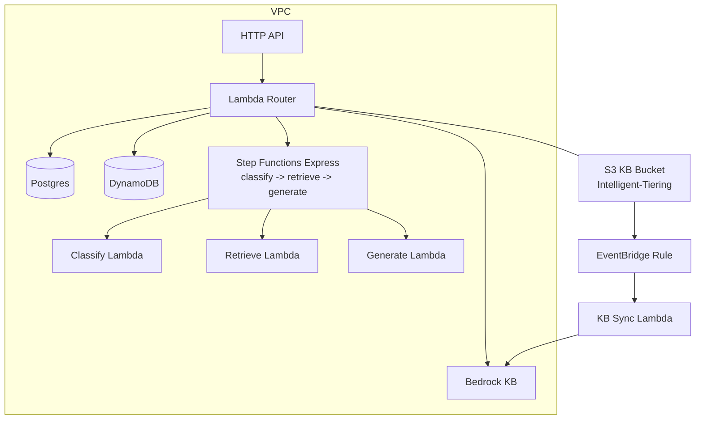
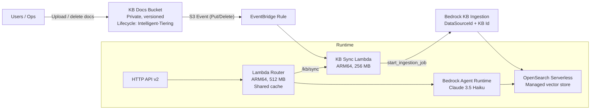
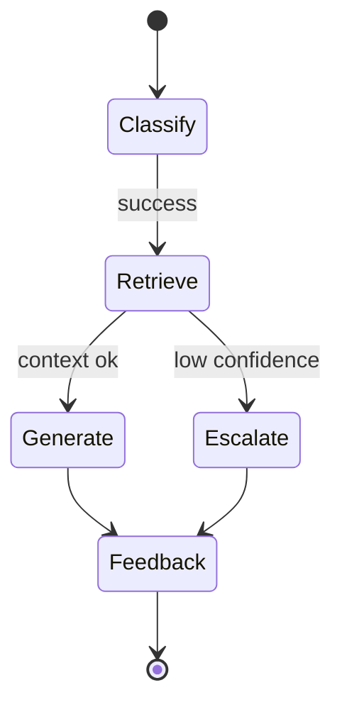
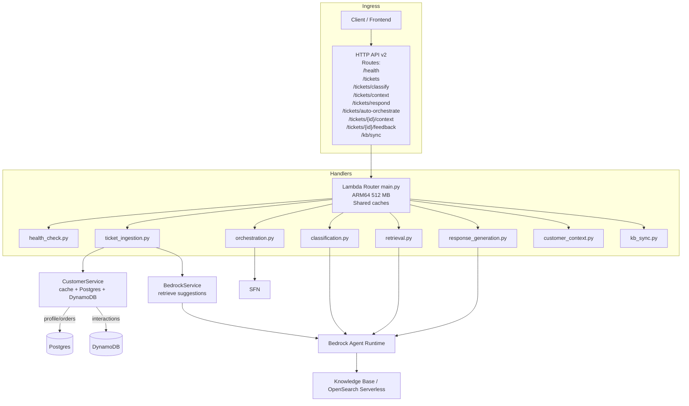
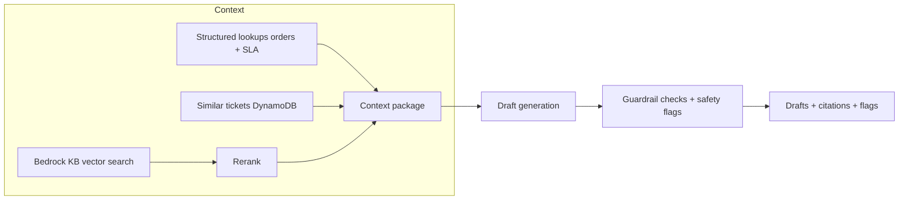

# Unified Architecture Overview

Single view of the platform across ingestion, knowledge, and agentic orchestration. Cost levers stay on by default (ARM64, no NAT in dev, Haiku-first).

## Core components
- **HTTP API (v2)** → **Lambda router** (thin) → handlers → services.
- **Step Functions (Express)**: classify → retrieve → generate drafts (fallback to in-Lambda orchestration when SFN ARN absent).
- **Bedrock Knowledge Base**: OpenSearch Serverless + Titan embeddings; S3 data source with lifecycle to Intelligent-Tiering.
- **Bedrock Models**: Claude 3.5 Haiku default; Sonnet opt-in per request; Titan embeddings for KB.
- **Data stores**: RDS Postgres (profiles/orders), DynamoDB (interaction logs, similar tickets placeholder).
- **Sync pipeline**: S3 put/delete → EventBridge → KB sync Lambda → Bedrock ingestion job.
- **Caching**: in-memory LRU for customer context, classification, KB retrieval.

## Infra diagram (runtime + ingestion)

## Bedrock Knowledge Base pipeline

## Agentic orchestration flow

**Control plane**
- API calls `/tickets/auto-orchestrate` → Lambda router → Step Functions `start_sync_execution` (Express for cost).
- If `STATE_MACHINE_ARN` absent (local/dev), Lambda orchestrates inline using the same services.

**Data plane**
- **Classify**: Haiku (Sonnet optional) with caching and heuristic fallback.
- **Retrieve**: vector search (KB) + structured lookups (customer orders/SLA) + similar tickets stub; cached where possible.
- **Generate**: Haiku default, Sonnet on demand; emits drafts + citations + safety flags; safe fallback text on failure.

## API flow (router + handlers)

## Context assembly & guardrails

## Data considerations
- Postgres: minimal storage (20 GB) and single AZ in dev; Multi-AZ + retention in prod.
- DynamoDB: on-demand + TTL to auto-trim interaction logs; future similar-ticket query can reuse.
- S3: Intelligent-Tiering by default; versioned, private.

## Operational knobs
- `ENVIRONMENT=prod` toggles DB retention/deletion protection and NAT usage.
- Lambda memory/timeout tunable via `Settings`; default ARM64 512 MB, 30s.
- Model selection: Haiku default, Sonnet via payload `use_sonnet`. Keep model IDs current per AWS Bedrock release notes.
- Caches: `CACHE_TTL_SECONDS`, `CACHE_MAX_SIZE` envs (classification/retrieval).

## Agentic additions at a glance
- Step Functions Express orchestration (classify → retrieve → generate) with inline fallback when `STATE_MACHINE_ARN` is absent.
- Endpoints: `/tickets/classify`, `/tickets/context`, `/tickets/respond`, `/tickets/auto-orchestrate`.
- Guardrails and safety flags: `pii_detected`, `off_brand`, `unsafe_content`, `low_context_confidence`; safe fallback drafts on model errors.
- Cost posture reinforced: Haiku-first, Sonnet opt-in, cached Bedrock calls, no NAT in dev, DynamoDB on-demand + TTL, Intelligent-Tiering for S3.

## Lifecycle summary
- Ingest: `/tickets` stores/returns customer context and KB suggestions.
- Classify/Retrieve/Respond: dedicated endpoints plus `/tickets/auto-orchestrate` for end-to-end flow.
- Sync: S3 events + manual `/kb/sync` keep KB fresh.
- Observability: structured JSON logs with correlation IDs; Step Functions traces when enabled.
