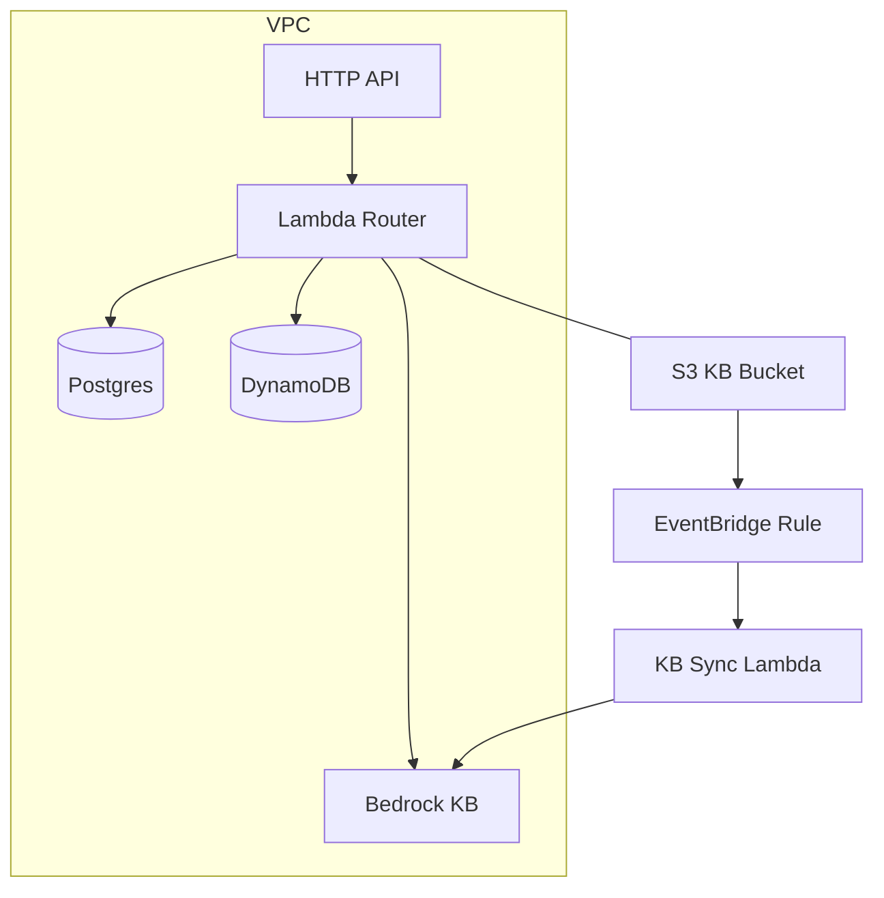

# Architecture Notes (Phase 1)

## Components
- **API Gateway HTTP API (v2)**: lower-cost, minimal latency ingress.
- **Lambda Router**: single function keeps caches warm and simplifies deployment.
- **Bedrock Knowledge Base**: managed vector store + Titan embeddings.
- **S3 Docs Bucket**: private, versioned, lifecycle to Intelligent-Tiering.
- **EventBridge Rule**: listens to S3 put/delete -> triggers KB sync Lambda.
- **RDS Postgres**: customer profiles and orders (t3.micro by default).
- **DynamoDB**: interaction logs with TTL for auto-expiry.

## Infra diagram

## Data considerations
- Postgres uses minimal storage (20 GB) and single AZ in dev; enable Multi-AZ only in prod.
- DynamoDB on-demand avoids capacity planning; TTL trims old logs to control costs.
- S3 uploads should prefer `INTELLIGENT_TIERING` storage class for cost efficiency.

## Operational knobs
- `ENVIRONMENT=prod` flips DB retention, deletion protection, and NAT.
- `lambda_memory_mb`, `lambda_timeout_seconds` in `Settings` tune Lambda cost/perf.
- Bedrock model IDs set to **Claude Haiku** and **Titan Embeddings** to stay cost friendly.
