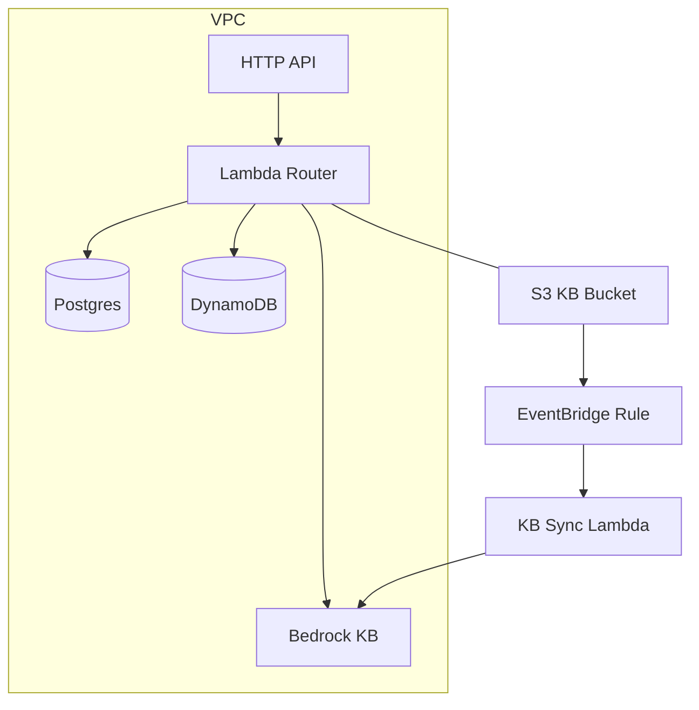
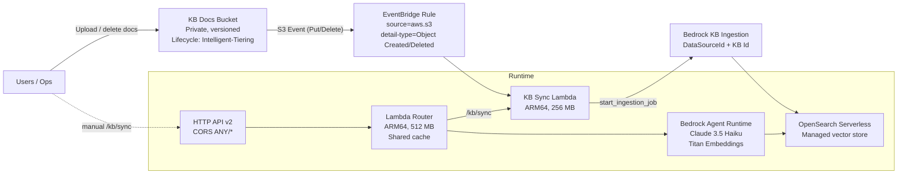
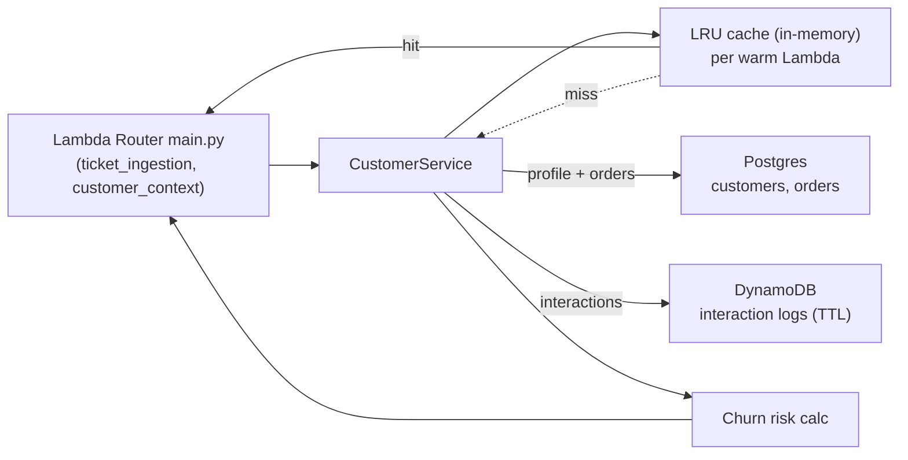
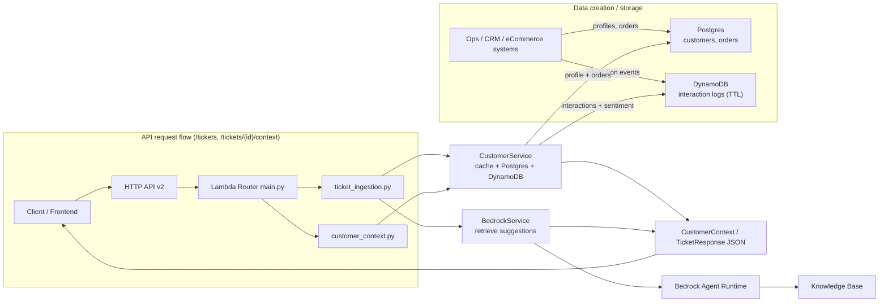

# Architecture Notes (Phase 1)

## Components
- **API Gateway HTTP API (v2)**: lower-cost, minimal latency ingress.
- **Lambda Router**: single function keeps caches warm and simplifies deployment.
- **Bedrock Knowledge Base**: managed vector store + Titan embeddings.
- **S3 Docs Bucket**: private, versioned, lifecycle to Intelligent-Tiering.
- **EventBridge Rule**: listens to S3 put/delete -> triggers KB sync Lambda.
- **RDS Postgres**: customer profiles and orders (t3.micro by default).
- **DynamoDB**: interaction logs with TTL for auto-expiry.

## Infra diagram

## Data considerations
- Postgres uses minimal storage (20 GB) and single AZ in dev; enable Multi-AZ only in prod.
- DynamoDB on-demand avoids capacity planning; TTL trims old logs to control costs.
- S3 uploads should prefer `INTELLIGENT_TIERING` storage class for cost efficiency.

## Operational knobs
- `ENVIRONMENT=prod` flips DB retention, deletion protection, and NAT.
- `lambda_memory_mb`, `lambda_timeout_seconds` in `Settings` tune Lambda cost/perf.
- Bedrock model IDs set to **Claude Haiku** and **Titan Embeddings** to stay cost friendly.

## Bedrock Knowledge Base pipeline

**Flow**
- Document upload/removal in `KnowledgeDocsBucket` emits S3 events.
- EventBridge rule triggers `KbSync` Lambda to start a Bedrock ingestion job for the KB data source.
- At query time, API → Lambda Router calls Bedrock Agent Runtime to retrieve relevant chunks from the KB.
- Manual sync is available via the `/kb/sync` endpoint; ops can also re-trigger ingestion without re-uploading.

## Web/API flow (Lambda router in `main.py`)

```mermaid
flowchart TB
  subgraph Ingress
    Client["Client / Frontend"] --> API["HTTP API v2<br/>Routes:<br/>/health<br/>/tickets<br/>/tickets/&#123;id&#125;/context<br/>/tickets/&#123;id&#125;/feedback<br/>/kb/sync"]
  end

  API --> Lmain["Lambda Router main.py<br/>ARM64 512 MB<br/>Shared caches per warm container"]

  subgraph Handlers
    Lmain --> Hhealth[health_check.py]
    Lmain --> Hticket[ticket_ingestion.py]
    Lmain --> Hcontext[customer_context.py]
    Lmain --> Hsync[kb_sync.py]
  end

  Hhealth --> Resp1["JSON 200"]
  Hticket --> SvcCust["CustomerService<br/>LRU cache + DB/DDB"] -->|profile/orders| RDS[(Postgres)]
  SvcCust -->|interactions| DDB[(DynamoDB)]
  Hticket --> SvcKB["BedrockService<br/>retrieve suggestions"] --> BRRT["Bedrock Agent Runtime"]
  BRRT --> BR["Knowledge Base / OpenSearch Serverless"]
  Hticket --> Resp2["TicketResponse JSON"]

  Hcontext --> SvcCust
  Hcontext --> Resp3["CustomerContext JSON"]

  Hsync --> BRAPI["Bedrock Agent API<br/>start_ingestion_job"]
  BRAPI --> Resp4["Sync started JSON"]
```

**Key points**
- Single Lambda router keeps caches warm and reduces cold starts.
- Handlers stay thin; services encapsulate Bedrock, Postgres, DynamoDB access.
- `/kb/sync` can be called manually; S3 events also trigger ingestion (see KB pipeline).

## Customer Data Service (CustomerService)

**Notes**
- Cache survives warm invocations to cut DB/KB calls; TTL and max size are tunable.
- Postgres returns core profile and recent orders; DynamoDB returns recent interactions + sentiment.
- Risk scoring combines sentiment and recency to tag customers as low/medium/high risk.
- If DB credentials are absent, service returns a safe placeholder profile for local/dev runs.

## Ticket processing + Customer data (end-to-end)

**Lifecycle summary**
- Data creation: customer profiles/orders land in Postgres; interaction events land in DynamoDB (TTL trims old items).
- Serving: API Gateway → Lambda router → handlers call `CustomerService` to assemble context (with in-memory cache) and `BedrockService` for KB suggestions.
- Responses: ticket ingestion returns status + customer context + KB suggestions; context endpoint returns customer snapshot.
