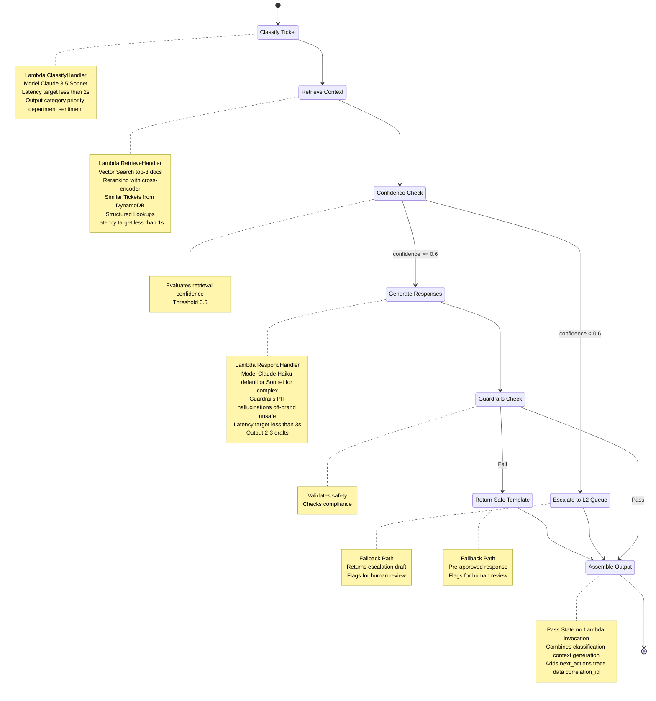

# Step Functions Workflow Diagram

## Phase 2: AI Agent Orchestration

This diagram visualizes the AWS Step Functions state machine that orchestrates the ticket classification, knowledge retrieval, and response generation workflow.

## Workflow Flow

### Happy Path (Main Flow)
1. **Input**: Ticket payload with title, description, customer data
2. **Classify**: Categorize ticket, extract priority, detect sentiment → `$.classification`
3. **Retrieve**: Fetch relevant knowledge and context → `$.context`
4. **Check Confidence**: Evaluate retrieval quality (threshold: 0.6)
5. **Generate**: Create 2-3 response drafts with guardrails → `$.generation`
6. **Check Guardrails**: Validate safety and compliance
7. **Assemble Output**: Combine all results with trace data

### Fallback Paths

#### Low Confidence Retrieval (KB < 0.6)
- **Trigger**: Retrieval confidence score below threshold
- **Action**: Route to L2 specialist queue
- **Output**: Escalation draft with reasoning
- **State**: `escalated_low_confidence`

#### Guardrail Failure
- **Trigger**: Generated response violates guardrails
- **Blocks**: PII leakage, hallucinations, off-brand language, unsafe content, overpromises
- **Action**: Return pre-approved safe template
- **Output**: Fallback response flagged for human review
- **State**: `fallback_guardrail_failure`

## Key Characteristics

### State Machine Type
- **Type**: EXPRESS (synchronous)
- **Timeout**: 5 minutes
- **Tracing**: X-Ray enabled
- **Name**: `ai-support-agent-{environment}`

### Data Flow
- All state is carried in the execution payload
- Each Lambda task writes to a specific path:
  - Classification → `$.classification`
  - Context Retrieval → `$.context`
  - Response Generation → `$.generation`
- Final Pass state assembles complete output

### Performance Targets
- **Classify**: <2 seconds
- **Retrieve**: <1 second
- **Generate**: <3 seconds
- **End-to-End P95**: <6 seconds

### Error Handling
- **Retry**: Lambda invocations auto-retry on service exceptions
- **Timeout**: Each Lambda has 30s timeout
- **Correlation**: All logs tagged with `correlation_id`

## Integration Points

### Entry Point
- **Handler**: `src/handlers/orchestration.py::lambda_handler`
- **API**: `POST /tickets/auto-orchestrate`
- **Input Validation**: Pydantic `TicketInput` model

### Lambda Functions
1. **ClassifyHandler**: `handlers.classification.lambda_handler`
2. **RetrieveHandler**: `handlers.retrieval.lambda_handler`
3. **RespondHandler**: `handlers.response_generation.lambda_handler`

### External Services
- **Bedrock**: Claude 3.5 models (Sonnet for classification, Haiku for generation)
- **DynamoDB**: Similar tickets lookup
- **Vector Store**: Knowledge base embeddings (OpenSearch/S3)
- **S3**: Prompt templates, cached context packages

## Monitoring & Observability

### Metrics
- `classify_latency`
- `retrieve_latency`
- `generate_latency`
- `end_to_end_latency_p95`
- `ragas_precision` / `ragas_recall`
- `guardrail_block_count`
- `fallback_rate`

### Logs
- Lambda Powertools structured logging
- X-Ray tracing across all steps
- Correlation ID in every log entry
- Timing data in final output

## Cost Optimization

- **ARM64 Architecture**: 20% cost savings on Lambda
- **Express State Machine**: Synchronous, no state persistence overhead
- **Claude Haiku**: Default for generation (cost-optimized)
- **Claude Sonnet**: Only for classification (requires superior reasoning)
- **Minimal State Passing**: Payload-only, no S3 intermediate storage
